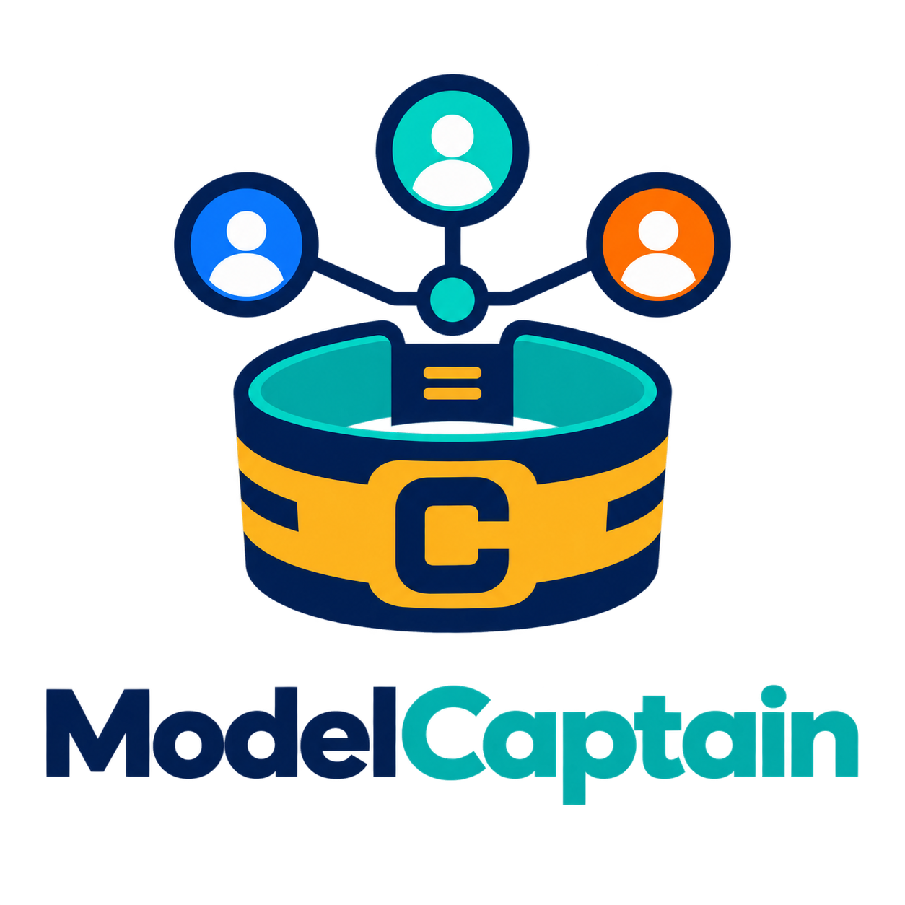

<p align="center">
  
</p>

# ModelCaptain

**Measure model configurations. Learn their strengths. Choose with evidence.**

A provider-neutral CLI for running a shared evaluation battery and producing scoped usage guidance. Like a captain selecting players for their roles, ModelCaptain aims to help you select models and native settings for particular kinds of work.

**Status: early alpha.** The foundation includes nine public programming microtasks and an optional 12-task experimental harder suite. These are a demonstration/pilot suite, **not a calibrated universal benchmark**. No model rankings or recommended vendor hierarchy are bundled. Real-world coding, architecture and autonomous-agent capability are not established by this suite.

## Why this exists

Model names and labels such as medium, high and xhigh do not tell you enough about suitability. ModelCaptain treats each model + native setting as a candidate and keeps measured quality, usage and time visible. Start with [the measurement framework](docs/measurement-framework.md) and [how selection works](docs/selection-process.md). Project-specific calibration is optional future work; the core direction is a common, versioned test battery and multidimensional capability profiles.

## Install from source

Python 3.11 or newer. No runtime dependencies.

```sh
git clone https://github.com/sandeep84397/model-captain.git
cd model-captain
python -m venv .venv
. .venv/bin/activate
python -m pip install -e .
model-captain --help
```

On Windows, activate with `.venv\Scripts\Activate.ps1` in PowerShell. Install from this repository; no PyPI publication is claimed.

## Offline demonstration

```sh
model-captain init
model-captain evaluate --provider demo --output results/demo.json
model-captain report --input results/demo.json
model-captain export --input results/demo.json --format agents-md --output results/DEMO-AGENTS.md
```

This creates local `model-guide.json` configuration and a synthetic report. **No API keys or model calls.** Default demo: 9 synthetic attempts. Demo data cannot recommend real models.

```sh
model-captain recommend --input results/demo.json --category debugging --task "Find the cause of a concurrency bug"
```

Demo recommendation intentionally returns exit code **2** with demonstration-only status. Demo export succeeds, but clearly marks its document as a demonstration rather than deployable routing advice.

## Evaluate configured API models

For existing Codex/Claude Code subscriptions, see [subscription CLI evaluation](#evaluate-through-your-existing-subscription). The `evaluate` command below remains the direct API track.

Replace starter `replace-me` model IDs in `model-guide.json` with exact IDs available to your account. Add separate candidates to compare native effort settings. Support varies by model; the provider remains the authority on compatibility. Ultra orchestration is not an API effort setting.

```json
{
  "version": 1,
  "candidates": [
    {"id": "openai-medium", "provider": "openai", "model": "YOUR_EXACT_OPENAI_MODEL_ID", "effort": "medium", "max_output_tokens": 4096},
    {"id": "anthropic-medium", "provider": "anthropic", "model": "YOUR_EXACT_ANTHROPIC_MODEL_ID", "effort": "medium", "max_output_tokens": 4096}
  ]
}
```

Set `OPENAI_API_KEY` and/or `ANTHROPIC_API_KEY` in your environment. Never put keys in configuration or reports.

```sh
# Paid API calls require explicit opt-in.
model-captain evaluate --provider openai --live --output results/openai.json
model-captain evaluate --provider anthropic --live --output results/anthropic.json

# One comparable run: 2 candidates × 9 tasks × 3 repetitions = 54 calls.
model-captain evaluate --provider all --live --repetitions 3 --max-requests 54 --output results/comparison.json
```

`all` selects live providers, excluding demo. The entire configuration, credentials, prompt sizes and planned calls are checked before requests. Runs above the request cap are rejected, not silently truncated. Default cap: 12 requests. No hidden retries.

Request and output limits **do not guarantee a dollar budget**. A low output cap can truncate reasoning-model answers; truncation counts as failure. Only fixed official endpoints are supported. Provider contracts are tested offline; live compatibility and benchmark results require separately recorded live runs.

## Read evidence and generate guidance

```sh
model-captain report --input results/comparison.json
model-captain recommend --input results/comparison.json --category debugging --task "Diagnose a race condition; preserve the public API and add regression tests"
model-captain export --input results/comparison.json --format agents-md --output results/AGENTS.md
model-captain export --input results/comparison.json --format claude-md --output results/CLAUDE.md
```

These commands make no model calls. Advice requires comparable complete coverage and verified model identity. The pilot threshold is at least 3 distinct tasks and 0.8 quality; this is **not** a confidence or safety guarantee. Monetary cost calculation is not implemented yet: cost stays unknown, even if pricing metadata is supplied. A shortlist can be more appropriate than a single candidate.

With fewer than 3 repetitions per task, every eligible candidate stays on the shortlist. With at least 3 repetitions, selection uses the **lowest observed median in this run**, without a statistical superiority claim. Reports show each candidate/category's pass count, latency and reported token totals. Missing usage remains unknown.

Optional `prices` metadata uses `{"as_of":"2026-09-05","input_per_million":1.0,"output_per_million":5.0}`. These example values are not provider prices. Unknown configuration fields are rejected, including inline credentials.

Instructions do not change your app's active model or grant autonomous permissions. `--task` supplies prompt text, not a validated classifier. Model-produced text is never executed or promoted into exported instructions.

## Evaluate through your existing subscription

Install the official Codex or Claude Code CLI and sign in there with your eligible subscription. ModelCaptain reuses that login locally; it does not read/copy credential files or accept subscription tokens. No separate API key is required for this track. API/billing environment overrides or an unverified login are rejected, never silently switched.

Copy [`examples/native-config.json`](examples/native-config.json), replace model IDs with IDs your CLI supports, and run:

```sh
# Two Codex configurations × nine tasks = 18 CLI invocations.
model-captain evaluate-native --provider codex-cli --config native-config.json --live --max-requests 18 --output results/codex.json

# One Claude configuration × nine tasks = nine CLI invocations.
model-captain evaluate-native --provider claude-cli --config native-config.json --live --output results/claude.json

model-captain report --input results/codex.json
model-captain recommend --input results/codex.json --category debugging --task "Diagnose a bug"
model-captain export --input results/codex.json --format agents-md --output results/NATIVE-AGENTS.md
```

These are real subscription-consuming runs. `max-requests` bounds **CLI invocations**, not the CLI's internal requests/retries. Each invocation has a configurable timeout; output-token ceiling and dollar cost remain unknown. ModelCaptain does not retry or request fallback models. First CLI failure stops the run and saves an incomplete report. Interruptions leave no new completed report.

Every task uses a fresh temporary directory and only the problem prompt. The text pilot restricts model tools and preserves normal host security controls. Host instructions, hooks, CLI startup and native context can still affect results. This is not yet repository-editing or autonomous-agent benchmarking.

Native reports use schema 2 and record CLI version, subscription auth method and invocation profile. API/demo schema 1 remains supported. The interfaces are not assumed equivalent. No API/native rankings are merged.

**Identity limitation:** a CLI may omit the model identity in its structured response. Such a run can show pass rates, latency and available usage, but cannot produce verified routing recommendations. Requested IDs are never substituted for observed IDs. Recommendation also requires identical CLI provider/version/profile and the same task matrix. Aliases can fail the exact identity check; prefer exact model IDs.

Native effort options in this text pilot are `low`, `medium`, `high`, `xhigh`, `max`, subject to CLI/model support. Ultra orchestration is not measured here. Existing subscriptions still have their own usage limits. These local adapters are not a way to turn subscription credentials into a general API service.

## Harder programming suite

The optional [12-task harder suite](docs/harder-benchmark.md) adds multi-step state traces, code-review comparisons and mutation-based test selection. Every answer key has executable offline checks. Difficulty is not yet empirically calibrated; no new model ranking is claimed. Run it with `--suite src/model_guide/data/programming-hard.json`.

## Custom suites and limits

Use `evaluate --suite path/to/suite.json`. The bundled [`programming.json`](src/model_guide/data/programming.json) is the format reference. Graders support exact answers and JSON subset checks. Reference answers stay out of live provider prompts.

Report schema version 1 includes the task manifest, exact attempt matrix and synthetic/live provenance. Validation catches inconsistent or incomplete records; it is **not cryptographic authentication** of an externally edited report. Use reports from a trusted local run. Custom-suite authors must check answer correctness and avoid disclosing reference answers in prompts; the CLI cannot establish benchmark validity automatically.

The alpha does not accept `--project`, execute generated code, upload repositories or discover account models. Native adapters currently measure text microtasks only. Repository-level agent evaluation remains [roadmap work](docs/roadmap.md).

## Development

```sh
python -m unittest discover -s tests -v
python -m model_guide --help
```

Tests use controlled transport fixtures and offline data. CI runs tests and installed CLI smoke on Python 3.11–3.14.

See [methodology](docs/methodology.md), [contributing](CONTRIBUTING.md) and [security](SECURITY.md). MIT licensed. Independent project; not affiliated with OpenAI or Anthropic. Logo concept generated with AI.
